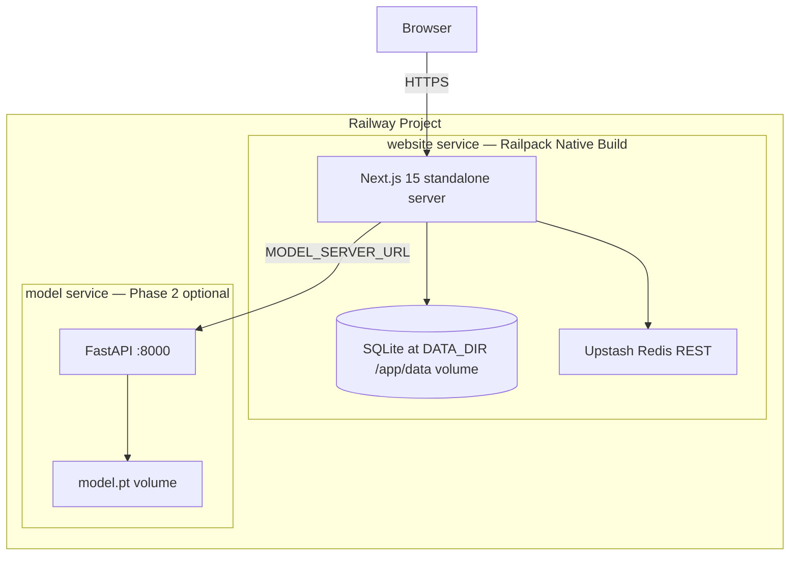

# Project Tracker — Badminton Action Classification

Status: ✅ Done · 🟡 Partial · ⬜ Not started · Last updated: 2026-06-25 (Railway Native Build)

> **Repo is now a monorepo:** `model/` (Python research + serving) and
> `website/` (Next.js 15 production platform). This tracker covers both.

## Roll-up

| Phase | Status | Notes |
|---|---|---|
| P0 Foundation (repo, config, CI, tests) | ✅ | 8 model test files, lint clean; website rate-limit test |
| P1 Modeling (features, models, CV, results) | ✅ | Deployed BiLSTM 3×256 → **5-fold CV 0.756 ± 0.058** (real test / synth-augmented train, leakage-safe) |
| P2 Serving (API, pose, video) | ✅ | `/health`, `/v1/predict/keypoints`, **`/v1/predict/video`** (video→pose→predict) live |
| P3 MLOps (registry, monitoring, retraining) | 🟡 | tracking + calibration done; registry/monitoring designed |
| P4 Hardening (security, load, cost) | 🟡 | **website hardened** (auth, 2FA, CSP, Redis rate-limit, validation, security audit); load/cost + model-server authN pending |
| **P5 Web platform (SaaS)** | ✅ | full Next.js app: auth + email verify + 2FA, upload→classify, dashboards, reports + PDF, DB |

## Data & features

- [x] Real dataset (5-class, 662 clips) in `data/archive/`; extracted keypoints in `data/kp/`
- [x] Keypoint normalization (translation/scale invariant) — tested
- [x] Kinematic features (velocity, bone angles, validity) — 89-D feature vector
- [x] Confidence masking + temporal interpolation
- [x] Whole-clip temporal sampling (`read_video_uniform`)
- [x] Graph layout for ST-GCN (joint-grouped channels)
- [x] Augmentation (mirror, jitter, dropout, noise)
- [x] Leakage-safe splits (video/player-disjoint) — tested
- [ ] DVC data versioning for `data/kp` + manifest
- [ ] Player labels (enable true player-disjoint eval)
- [ ] Larger corpus (≥5k clips) — biggest accuracy lever

## Modeling, training & evaluation

- [x] BiLSTM + attention (deployed: 3 layers, 256 hidden, dropout 0.25, T=1.84)
- [x] ST-GCN graph model (built + unit-tested, benchmarked)
- [x] Model factory (swap via `model.name`)
- [x] Training loop (seeded, class-weighted, early stopping)
- [x] Calibration (temperature scaling) + abstention
- [x] Metrics (per-class F1, confusion, ECE)
- [x] k-fold CV runner (group-stratified)
- [x] Hyperparameter tuning (`tune.py`, `configs/improved.yaml`) → tuned BiLSTM 3×256
- [x] **Synthetic augmentation** (2.3k synth clips) — used the *correct* way: synth in TRAIN
      only, eval on real held-out (`scripts/cv_synth_train.py`)
- [x] **5-fold CV (defensible): 0.756 ± 0.058** acc, 0.749 ± 0.060 F1, 0.094 ECE — real test,
      synth-augmented train. (+16 pts over real-only 0.59; the naive 0.852 was synth-in-test leakage)
- [x] Transfer-learning scaffold (`convert_external.py`, `configs/finetune.yaml`, `train.init_from`)
- [ ] Reduce ECE (0.094) and fold variance (one fold dipped to 0.652)
- [ ] Acquire external data (VideoBadminton / ShuttleSet) — biggest lever, see Next steps
- [ ] Run pretrain → fine-tune on external data (scaffold ready)
- [ ] Hierarchical classifier (FH/BH → shot) for drive↔clear confusion

## Inference & serving (`model/src/badminton/serving`)

- [x] Pluggable `PoseEstimator` interface
- [x] RTMPose backend (rtmlib/ONNX) — verified on real video
- [x] Video decoders (`read_video`, `read_video_uniform`)
- [x] `ActionPredictor` (calibrated, abstains) — end-to-end verified
- [x] FastAPI keypoint endpoint (`/v1/predict/keypoints`)
- [x] **FastAPI video endpoint (`/v1/predict/video`)** — upload → RTMPose → predict
- [x] Self-contained checkpoint (weights + config + temperature + feature_dim)
- [ ] ONNX export of action model
- [ ] Async job queue + worker (designed)
- [ ] GPU batching / model server (Triton/TorchServe)
- [ ] Multi-person tracking for doubles (motion-energy heuristic only)

## Web platform — P5 (`website/`)

Next.js 15 (App Router) + TypeScript + Tailwind + Framer Motion. Backend in Next route
handlers with `node:sqlite`.

**Auth & accounts**
- [x] Sign-up / login / logout — scrypt-hashed passwords, DB-backed sessions (httpOnly)
- [x] **Email verification** — real 6-digit code, 15-min expiry, single-use (nodemailer; dev outbox)
- [x] **Email 2FA** — opt-in one-time login code (`/auth/two-factor`, settings toggle)
- [x] One-click demo workspace

**Core product**
- [x] Upload → classify (`/api/classify`) with client + server validation; forwards to the
      model server when `MODEL_SERVER_URL` is set, else simulated, persisted per-user
- [x] Dashboard (live KPIs, shot distribution), Classifications table, Videos list
- [x] **Reports** generated from real data + **server-side PDF export** (pdf-lib)
- [x] Settings: training-consent opt-in (persisted), 2FA toggle
- [x] Database: users, sessions, email_tokens, videos, classifications, reports

**Security & infra**
- [x] Nonce-based Content-Security-Policy + security headers (middleware)
- [x] Auth guard on `/app/*`
- [x] **Redis-backed rate limiting** (`lib/rate-limit.ts`, `lib/redis.ts`)
- [x] Input validation layer (`lib/validations.ts`); upload MIME/size sanitisation
- [x] Comprehensive security-audit pass (see git history)
- [x] Premium UI: intro animation, velocity-morphing custom cursor, interactive skeleton explorer
- [ ] Team management (page exists; invites are stubbed)
- [x] **Railway Native Build config** (Railpack) — `website/railway.toml`, `railpack.json`, standalone start
- [x] **Production deploy on Railway** — https://web-production-f4ee7.up.railway.app (Railpack, 2026-06-25)
- [ ] Load test

## MLOps, infra & quality

- [x] Experiment tracking (MLflow, `mlruns/`)
- [x] Unit/integration tests (model: 8 files; website: rate-limit test)
- [x] Lint (ruff) clean
- [x] Docker + CI (GitHub Actions)
- [x] GPU paths (Colab CUDA notebook, Apple MPS)
- [x] `requirements.txt` for the model package
- [ ] Enforce type checking (mypy advisory)
- [ ] Model registry + promotion gate (target macro-F1 ≥ 0.85, ECE ≤ 0.05 — **tuned model meets it**)
- [ ] Drift monitoring (Evidently) + Prometheus/Grafana
- [ ] Automated retraining triggers

## Documentation

- [x] README (workflow, models, GPU)
- [x] Professional report (HTML + PDF)
- [x] Colab GPU notebook
- [x] **Milestone-2 pack** (video script, report, architecture mapping, demo runbook, figures)
- [x] This tracker · project memory

## Results log

| Date | Model | Config | Eval | Accuracy | Macro-F1 | ECE |
|---|---|---|---|---|---|---|
| (paper) | 5-layer LSTM | 4-class, frame split | test | 0.80 | — | — |
| (paper) | CNN | 4-class | test | 0.60 | — | — |
| 2026-06-23 | BiLSTM | 16-frame (first ~1.6s) | 5-fold CV | 0.456 ± 0.035 | 0.443 | 0.064 |
| 2026-06-23 | BiLSTM | 16-frame | held-out test | 0.535 | 0.507 | 0.080 |
| 2026-06-24 | BiLSTM | 24-frame whole-clip | 5-fold CV | 0.590 ± 0.053 | 0.575 ± 0.060 | 0.086 |
| 2026-06-24 | ST-GCN | 24-frame whole-clip | 5-fold CV | 0.502 ± 0.059 | 0.491 ± 0.052 | 0.077 |
| 2026-06-24 | BiLSTM 3×256 (tuned) | naive real+synth, single split | held-out test | 0.852 ⚠️ | 0.853 | 0.039 |
| **2026-06-25** | **BiLSTM 3×256 (tuned, deployed)** | **synth-augmented train / real test** | **5-fold CV** | **0.756 ± 0.058** | **0.749 ± 0.060** | **0.094** |

Chance = 0.20 (5 classes). **Headline (defensible) = 0.756 ± 0.058 acc / 0.749 ± 0.060 F1 on a
leakage-safe 5-fold CV** (real held-out test; synthetic clips augment TRAIN only). Per-fold acc:
[0.735, 0.652, 0.812, 0.788, 0.795].

⚠️ The earlier **0.852** was a *single split over real+synthetic together*: synthetic clips are
augmented near-duplicates of random real clips, so siblings leaked across train/test and inflated
the score. Done correctly (synth→train, eval on real) the model lands at **0.756**. This still beats
the paper's CNN (0.60) and is statistically comparable to its LSTM (0.80 on a single 40-clip split,
±~12% CI overlaps ours) — while being calibrated and leakage-safe, which the paper is not. Firm
earlier findings hold: whole-clip beats 16-frame (+13.4 pts); BiLSTM beats ST-GCN; synthetic
augmentation adds +16 pts over real-only (0.59 → 0.756).

## Next steps (priority order)

1. [x] ~~5-fold CV on the tuned config~~ → **0.756 ± 0.058** (done 2026-06-25)
2. [ ] **Acquire external data** — VideoBadminton (7,822 clips) / ShuttleSet skeletons
3. [ ] **Pretrain → fine-tune** on external data (scaffold ready) — push past 0.80
4. [ ] Reduce ECE / fold variance; re-tune now that eval is honest
5. [ ] ONNX export + async video queue for the model server
6. [ ] Model registry + promotion gate + drift monitoring (close the MLOps loop)
7. [ ] Website: finish team management + load test
8. [ ] Model server: second Railway service (Phase 2) when real inference needed in prod

## Deployment knowledge graph (`website/` → Railway)

> Tracks how the production web app is built, configured, and wired. Updated when deploy
> config changes.

### Topology

### Build pipeline (Native Build — not Dockerfile)

| Step | What runs | Config source |
|---|---|---|
| Detect builder | **Railpack** (overrides `Dockerfile`) | [`website/railway.toml`](../../website/railway.toml) `builder = "railpack"` |
| Install | `npm ci` | auto |
| Node version | **24** (`node:sqlite` + Next 15) | [`website/railpack.json`](../../website/railpack.json), `package.json` engines |
| Build | `npm run build` | `package.json` |
| Post-build | Copy `.next/static` + `public` → standalone | `package.json` `postbuild` |
| Start | `node .next/standalone/server.js` | `railway.toml` + `HOSTNAME=0.0.0.0`, Railway `PORT` |

**Local Docker still works:** [`website/Dockerfile`](../../website/Dockerfile) + [`entrypoint.sh`](../../website/entrypoint.sh) kept for dev; Railpack builder ignores them on Railway.

### Railway dashboard checklist (website service)

| Setting | Value |
|---|---|
| Root Directory | `website` |
| Config File Path | `/website/railway.toml` |
| Volume mount | `/app/data` (SQLite persistence) |
| Watch Paths | `/website/**` |

### Environment variables

| Variable | Required prod? | Purpose |
|---|---|---|
| `UPSTASH_REDIS_REST_URL` | **yes** | Rate limiting (lazy-init in `lib/redis.ts`) |
| `UPSTASH_REDIS_REST_TOKEN` | **yes** | Rate limiting auth |
| `NEXT_PUBLIC_SITE_URL` | recommended | Canonical URL — drives `SITE.url` (metadata, sitemap, robots, JSON-LD) |
| `HOSTNAME` | **yes** | `0.0.0.0` — bind all interfaces |
| `RAILWAY_RUN_UID` | **yes** (with volume) | `0` — volume write access without Docker entrypoint |
| `DATA_DIR` | optional | Default `{cwd}/data`; use `/app/data` if overriding |
| `SMTP_*`, `MAIL_FROM` | optional | Real email; dev uses outbox.log |
| `MODEL_SERVER_URL` | optional | Real inference; else simulated |
| `PORT` | auto (Railway) | **Do not set manually** |

Template: [`website/.env.example`](../../website/.env.example)

### Config files map

| File | Role |
|---|---|
| `website/railway.toml` | Builder, build/start commands, health check, watch paths |
| `website/railpack.json` | Pin Node 24 for Railpack |
| `website/package.json` | `engines`, `postbuild`, standalone `start` |
| `website/next.config.mjs` | `output: "standalone"` |
| `website/Dockerfile.docker` | Local Docker only (`docker build -f Dockerfile.docker`); renamed so Railway does not auto-detect Dockerfile |
| `website/vercel.json` | Vercel alternative deploy |

### Deploy verification signals

| Check | Pass criterion |
|---|---|
| Build logs | Railpack builder — **no** `Using detected Dockerfile!` |
| Homepage | CSS/JS load (standalone static copy succeeded) |
| Auth signup | SQLite writes to volume (`/app/data/app.db`) |
| Classify | 429 after rate limit (Upstash connected) |

### Common failures → fixes

| Symptom | Fix |
|---|---|
| Dockerfile still used | Set Config File Path to `/website/railway.toml` |
| Blank page / 404 static | Confirm `postbuild` ran after `next build` |
| `node:sqlite` error | Node < 22.13 — confirm `railpack.json` pins Node 24 |
| `Missing UPSTASH_REDIS_*` | Add vars in Railway Variables tab |
| `SQLITE_CANTOPEN` / EACCES | `RAILWAY_RUN_UID=0`, volume at `/app/data` |
| Connection refused | `HOSTNAME=0.0.0.0` |

## External datasets (data-acquisition targets)

| Dataset | Size | Classes | Access | Use |
|---|---|---|---|---|
| VideoBadminton | 7,822 clips | 18 | email authors | direct expansion (clips → our pipeline) |
| ShuttleSet | 36,492 strokes | 18 | annotations public; BWF videos | large; needs segmentation |
| BST repo skeletons | ShuttleSet/BadmintonDB | 35/25/18 | Google Drive (.npy) | pretraining (joint adapter ready) |
| NTU RGB+D | 114k clips | 120 generic | public | generic ST-GCN pretraining |
